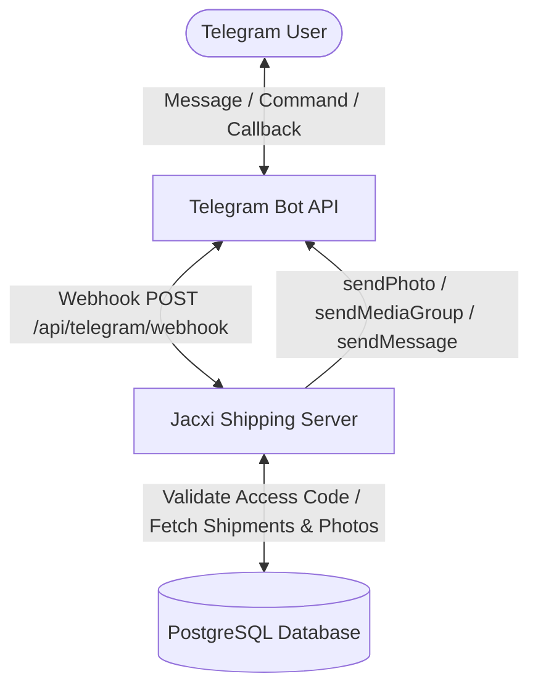

# Telegram Bot Webhook Integration

This document describes the Telegram Bot Webhook integration for **Jacxi Shipping**, enabling customers to access real-time shipment updates, vehicle specifications, arrival/warehouse inspection photos, and financial details directly inside Telegram, securely authenticated with their **8-digit Customer Access Code**.

---

## Architecture Overview



---

## Features

1. **Secure Customer Login with 8-Digit Code**:
   - Customer starts the bot (`/start` or `/login`).
   - Bot prompts for the 8-digit access code (e.g. `83492019` or alphanumeric `JACX1234`).
   - Supports both alphanumeric and phone-keypad translated digits (`22231234`).
   - Securely links the Telegram `chat_id` to the customer's Jacxi account.

2. **Shipment Information Cards**:
   - Lists active and historical shipments.
   - Shows Vehicle Year/Make/Model, Color, VIN, Lot #, Auction House.
   - Ocean Container details: Container #, Vessel Name, Voyage, Shipping Line.
   - Port milestones: Loading Port, Departure Date, Destination Port, Estimated Arrival (ETA), Actual Arrival.
   - Visual Progress Bar: `[████████░░] 80%`.

3. **High-Resolution Inspection & Arrival Photos**:
   - Sends warehouse arrival photos and vehicle condition inspection photos.
   - Groups photos into Telegram photo albums (`sendMediaGroup`) with VIN and vehicle captions.
   - One-tap access via inline `📸 Photos` buttons.

4. **Live Ocean Tracking**:
   - Customers can type any VIN or Container number to get instant live status and tracking events.

5. **Financial & Invoices Summary**:
   - Current ledger balance.
   - Outstanding / Due invoices with payment milestones.
   - Completed payments overview.

6. **Interactive Navigation**:
   - Persistent quick-reply keyboard.
   - Inline callback buttons under each vehicle card for instant one-click photos and tracking.

---

## Configuration & Environment Variables

Add the following variables to your `.env` or deployment settings:

```env
# Telegram Bot Token from @BotFather
TELEGRAM_BOT_TOKEN="123456789:ABCdefGHIjklMNOpqrSTUvwxYZ"

# Optional: Bot Username without @
TELEGRAM_BOT_USERNAME="JacxiShippingBot"

# Optional: Secret token for webhook header verification (X-Telegram-Bot-Api-Secret-Token)
TELEGRAM_WEBHOOK_SECRET="your-secure-webhook-secret"

# App URL (used for Webhook URL and photo links)
NEXT_PUBLIC_APP_URL="https://yourdomain.com"
```

---

## Setting Up the Webhook

### Method 1: Automatic Setup via API Endpoint
Once you deploy or run the server, you can set the webhook by sending a POST request to:

```http
POST /api/telegram/setup
Headers:
  Content-Type: application/json
  x-setup-key: <CRON_SECRET or NEXTAUTH_SECRET> (or authenticated as Admin)

Body:
{
  "url": "https://yourdomain.com/api/telegram/webhook"
}
```

### Method 2: Check Webhook Status
```http
GET /api/telegram/setup
```
Returns:
```json
{
  "configured": true,
  "bot": {
    "id": 123456789,
    "is_bot": true,
    "first_name": "Jacxi Shipping Bot",
    "username": "JacxiShippingBot"
  },
  "webhookInfo": {
    "url": "https://yourdomain.com/api/telegram/webhook",
    "has_custom_certificate": false,
    "pending_update_count": 0
  }
}
```

### Method 3: Direct via Telegram API
```bash
curl -X POST "https://api.telegram.org/bot<TELEGRAM_BOT_TOKEN>/setWebhook" \
     -H "Content-Type: application/json" \
     -d '{"url": "https://yourdomain.com/api/telegram/webhook", "secret_token": "your-secure-webhook-secret"}'
```

---

## Bot Commands

| Command | Action |
|---|---|
| `/start` | Welcome message & login prompt / Main menu |
| `/shipments` | List all customer vehicle shipments |
| `/photos` | View arrival & inspection photos |
| `/track <VIN>` | Live ocean container & inland tracking |
| `/finance` | Outstanding balance & invoices |
| `/account` | View profile & linked status |
| `/logout` | Unlink Telegram session |
| `/help` | Bot command manual |
